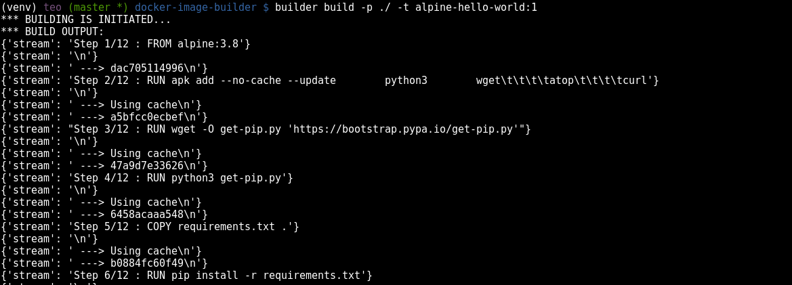
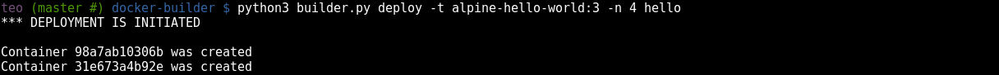
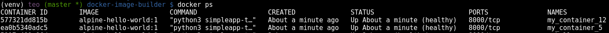
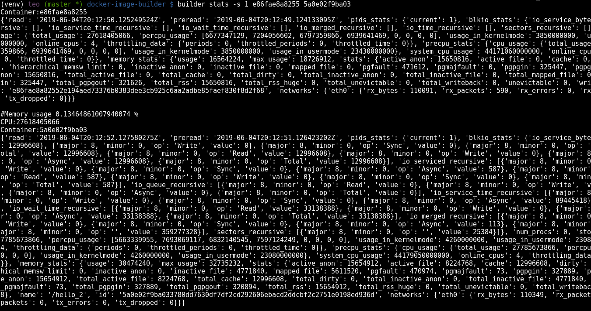
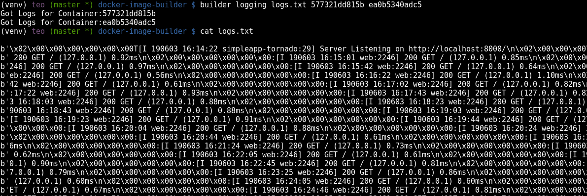

# Docker Python Tool


##### Table of Contents  
- [Introduction](#introduction)
- [Getting Started](#gettingstarted)  
  - [Prerequisites](#prerequisites)  
- [Usage](#usage)
- [Testing](#testing)
- [Examples of use](#examples-of-use)
- [Technologies](#technologies)

## Introduction
This repository contains a python tool automating operations with docker containers by utilizing the Docker Remote API. This python tool implements the following:

- Building a Docker Image from a given Dockerfile and an application (a ‘Hello world’ web application)
- Starting a few instances of the Docker Image in different containers
- Validating that the container instances are running
- Monitoring the resource usage of each container (CPU, I/O, etc)
- Consolidating the log output of all the container instances into one centralized log file.

## Getting Started

### Prerequisites

Please make sure you've already ***Python3***. The tool is utilizing the ***Docker Remote API***, which is set up in tcp://0.0.0.0:2376. For the purpose of using the tool, you should set up the Remote API likewise. The following instructions apply to Ubuntu 16.04 and Debian 9.9 (stretch).

Edit the file:
```
sudo nano /lib/systemd/system/docker.service
```
Update with:
```
ExecStart=/usr/bin/dockerd -H fd:// -H tcp://0.0.0.0:2376
```
Then, restart the docker service running below commands:
```
sudo systemctl daemon-reload
sudo systemctl restart docker
sudo systemctl status docker
```

For older versions than Ubuntu 16.04 you can use the instructions in the following source,  [Enabling and accessing Docker Engine API on a remote docker host on Ubuntu](https://medium.com/@sudarakayasindu/enabling-and-accessing-docker-engine-api-on-a-remote-docker-host-on-ubuntu-16-04-2c15f55f5d39)

## Usage

The tool is equipped with five commands: *build*, *deploy*, *validate*, *stats* and *logging* as presented below:

  

Finally, invoke one of the tool's commands:
```
python3 builder.py [build, deploy, validate, stats, logging] --help
```


## Testing

To test the python tool follow the instructions below.
1. First install virtual environment:

```
apt-get install virtualenv
```

2. Then, in the same depth as the project make a folder named ***venv***:

```
mkdir venv
```

3. Execute the following command:

```
virtualenv -p python3 venv/
```
4. Get up and running a virtual environment by running executing:

```
. venv/bin/activate
pip install --editable .
```

5. Finally, execute the *build* command to build the image according the instructions that are defined in a Dockerfile:

```
builder --help
builder build -d ./ -t "alpine_hello_world:1"
```

6. Exit virtual environment by invoking:

```
deactivate
```


## Examples of use


Each one of these commands has each one functionality which can be over-viewed by invoking each command followed by **--hep**. The following screen-shots indicate the usage of each command.

Build a Container Image:
  

Deploy a Number of Containers:
  

  

Validate the Operation of Each Container:
  

Monitor the Resource Usage of Each Container:
  

Consolidate Logs of a Number of Containers Into a Local File by providing the filename:
  

## Technologies
* [Docker](https://www.docker.com/)
* [Click](https://click.palletsprojects.com/en/7.x/)

